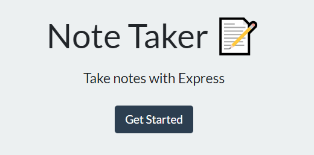

# note-taker
Note taker is a node/express application that takes notes and stores them on a local json file called db.json. Fs is utilized to write or read db.json. Express is used to listen to requests from the front end and serve back responses.

 ## License
This project is licensed under the MIT License - see the [LICENSE.md](LICENSE.md) file for details